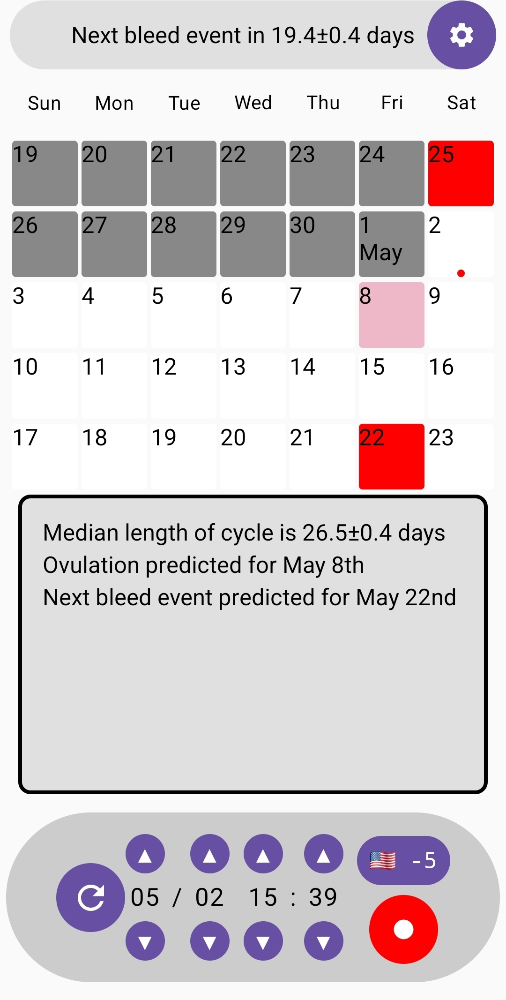
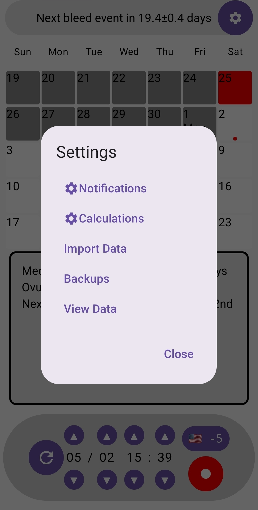
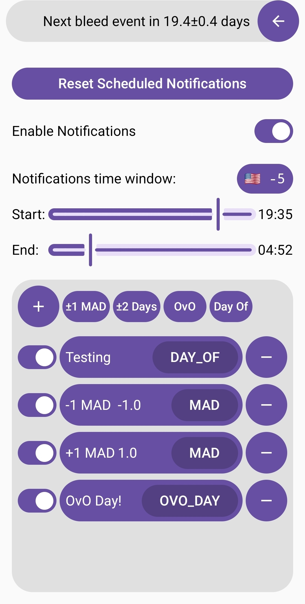
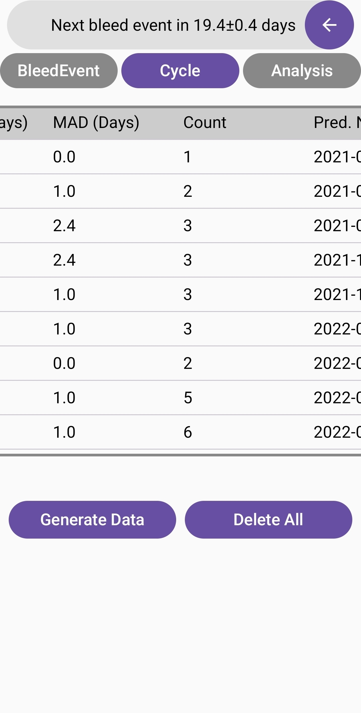
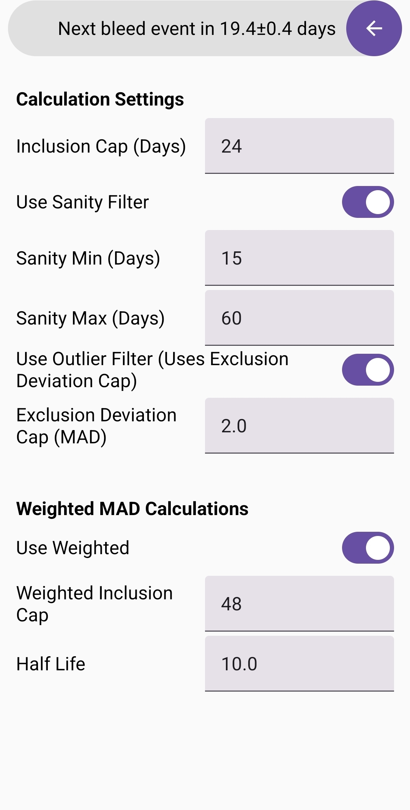

# OvO

> A privacy-first offline menstrual cycle tracking application built in Kotlin for Android.

OvO is a personal software engineering project focused on local-first health tracking, statistical cycle prediction, and transparent user-controlled data analysis.

The project was designed around a simple principle:

- user data should remain local
- calculations should be inspectable
- predictions should be configurable rather than opaque
- recording cycle information should be fast and frictionless

---

## Features

### Cycle Tracking
- Quick cycle/bleed event recording
- Historical cycle visualization
- Manual data management and editing
- Fast input workflow optimized for repeated use

### Prediction System
- Future cycle prediction estimates
- Configurable statistical calculation settings
- Rolling cycle analysis
- Median and deviation-based filtering logic
- Prediction quality inspection and analysis

### Offline-First Architecture
- Fully local data storage
- No accounts
- No cloud dependency
- No analytics or telemetry
- No external backend services

### Data Management
- CSV import/export support
- Backup and restore functionality
- Raw data inspection tools
- Internal calculation visibility

### User Utilities
- Notification support
- Calculation inspection menus
- Settings customization
- Data exploration utilities

---

## Screenshots

> Replace these placeholders with your actual screenshots after uploading them to the repository.

### Main Screen


### Settings


### Notifications


### Data Viewer


### Calculation Menu


---

## Technical Overview

OvO was built as a deeper exploration into:

- Android application architecture
- local-first software systems
- statistical modeling
- state management
- persistent data handling
- human-centered utility software

The application emphasizes deterministic and explainable calculations over black-box prediction systems.

### Core Technical Concepts

#### Local Data Persistence
Cycle and prediction data are stored locally using SQLite-based persistence through Kotlin Android tooling.

#### Statistical Prediction Modeling
The prediction system uses rolling historical cycle analysis with configurable filtering and deviation handling.

Concepts explored include:
- rolling medians
- median absolute deviation (MAD)
- outlier rejection
- normalized prediction error
- rolling prediction evaluation

#### Configurable Computation
Users can modify prediction parameters and inspect how settings impact prediction quality and resulting outputs.

#### Import / Export Pipeline
The application supports data portability through export and import functionality, enabling:
- backup recovery
- device migration
- external analysis workflows

---

## Tech Stack

- Kotlin
- Android SDK
- Jetpack Compose
- SQLite / Room persistence
- Material Design components

---

## Project Goals

OvO was created as both:
1. a functional personal utility application
2. a portfolio project demonstrating practical software engineering and applied data modeling concepts

Areas intentionally explored during development:
- mobile architecture
- offline application design
- statistical computation systems
- configurable prediction engines
- UX for repeated daily interaction
- persistent state management

---

## Installation

### Requirements
- Android Studio
- Android SDK
- Kotlin support enabled

### Clone

```bash
git clone https://github.com/<your-username>/OvO.git
```

### Run

Open the project in Android Studio and run on an Android device or emulator.

---

## Design Philosophy

OvO intentionally avoids:
- mandatory accounts
- cloud synchronization
- behavioral analytics
- advertising
- unnecessary data collection

The project prioritizes:
- ownership of personal data
- transparency of calculations
- responsive offline usability
- simplicity of interaction

---

## Future Work

This project is currently considered feature-complete for its intended scope.

Potential experimental directions that were explored conceptually include:
- machine learning assisted prediction models
- REST-based synchronization services
- expanded biological data modeling
- cross-device support

These are not currently planned development targets.

---

## What This Project Demonstrates

This repository demonstrates experience with:

- Kotlin application development
- Android UI architecture
- Jetpack Compose
- local database design
- state-driven UI systems
- statistical modeling concepts
- configurable computation pipelines
- import/export workflows
- offline-first software engineering
- user-focused utility application design

---

## License

License has not yet been selected.

---

## Author

Nicholas Ball Ulmer

- GitHub: https://github.com/nick-ulmer
- Portfolio: https://f1forhelp.dev
- LinkedIn: https://linkedin.com/in/nicholas-ball-ulmer/

